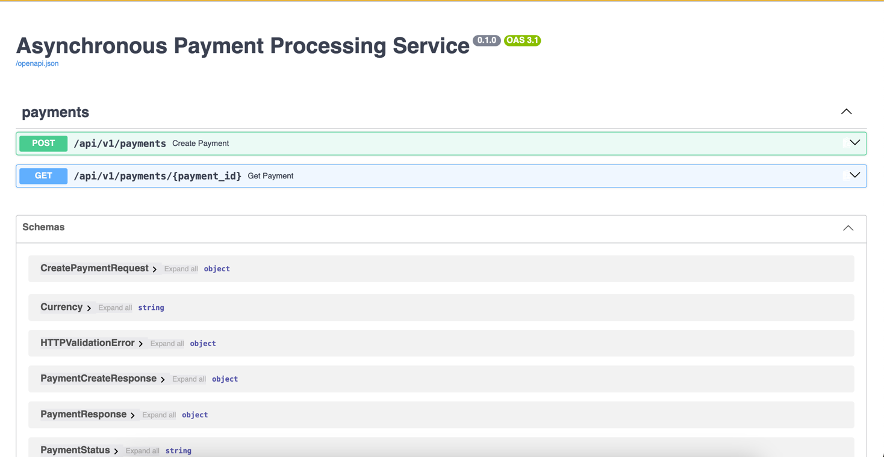
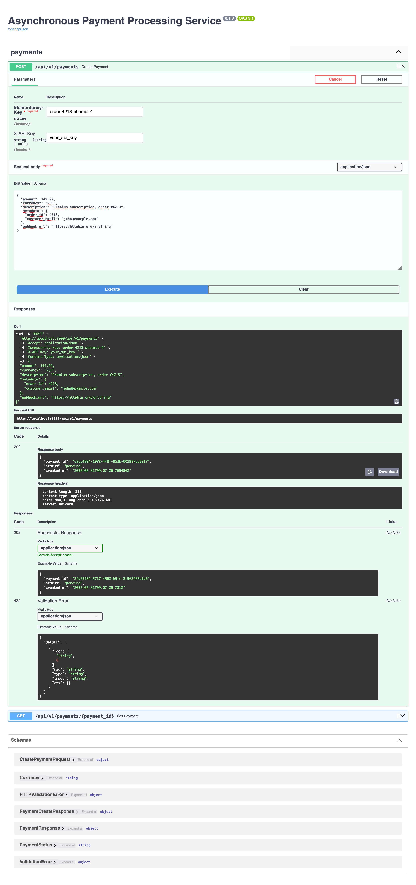
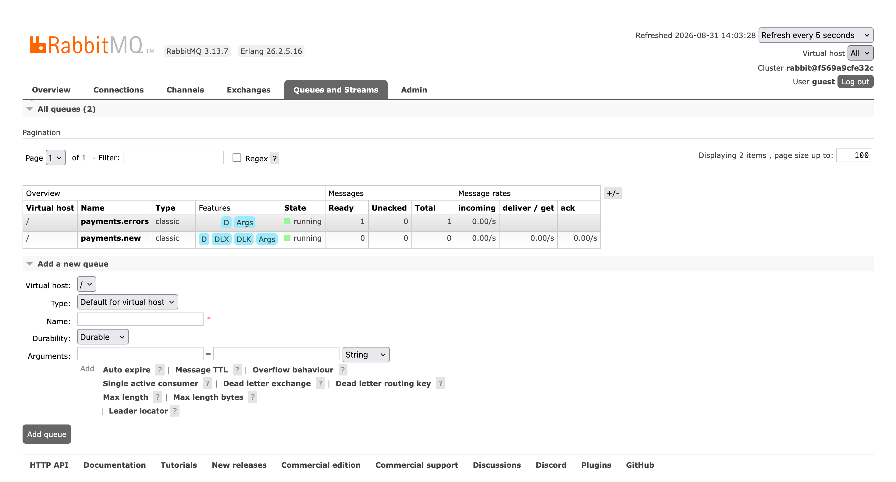
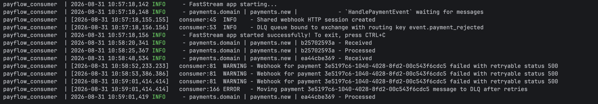
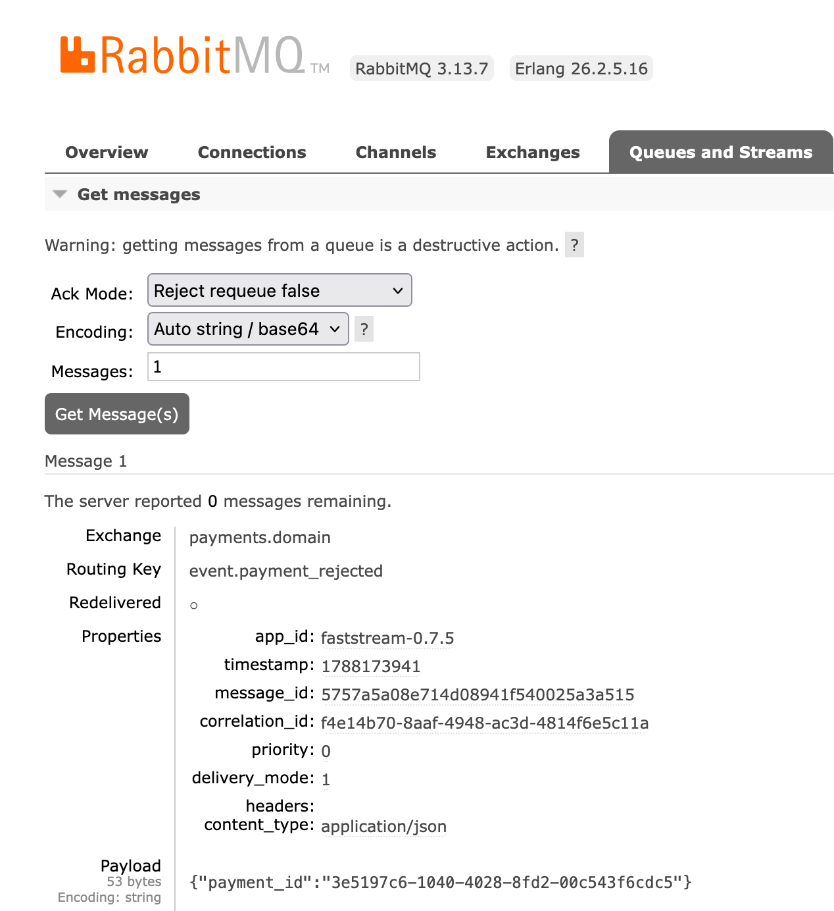

# Payflow Engine

Async payment processing service built on the transactional outbox pattern: FastAPI + PostgreSQL 17 + RabbitMQ (FastStream).

## Architecture

1. The API creates a payment and its outbox event within a single database transaction
2. A background publisher polls pending outbox events (`FOR UPDATE SKIP LOCKED`) and publishes them to RabbitMQ
3. The consumer processes payments and delivers webhooks with retries
4. Poison messages are routed to the dead letter queue `payments.errors`


## Tech Stack

- Python 3.14, FastAPI
- SQLAlchemy 2 (asyncpg), PostgreSQL 17, Alembic
- RabbitMQ, FastStream
- aiohttp for webhook delivery, uv for dependency management, Docker Compose

## Quick Start

```bash
cp .env.template .env
docker compose up --build
```

The API is served at `http://localhost:8000`, interactive docs at `http://localhost:8000/docs`. Database migrations are applied automatically on container start.



## API

All endpoints under `/api/v1` require the `X-API-Key` header.

| Method | Path | Description |
|---|---|---|
| POST | `/api/v1/payments` | Create a payment. Requires `Idempotency-Key` header. `webhook_url` must use `https`. Returns `202` when created, `200` for a repeated idempotent request |
| GET | `/api/v1/payments/{payment_id}` | Get payment status and details |

Request body for creating a payment:

```json
{
  "amount": 100.50,
  "currency": "USD",
  "description": "Order #4213",
  "metadata": {"order_id": 4213},
  "webhook_url": "https://example.com/payments/webhook"
}
```



## How It Works

1. `POST /api/v1/payments` writes the payment and a `payment.created` event in one transaction
2. The outbox publisher picks up pending events without blocking concurrent instances and marks them processed right after a successful publish
3. The consumer sets the final payment status (`succeeded`/`failed`) and sends a webhook; only 429/5xx responses and network errors are retried with backoff
4. Undeliverable messages end up in the `payments.errors` DLQ



## Environment Variables

| Variable | Description |
|---|---|
| `API_KEY` | API key required by all endpoints |
| `POSTGRES_DB` / `POSTGRES_USER` / `POSTGRES_PASSWORD` / `POSTGRES_HOST` / `POSTGRES_PORT` | PostgreSQL connection |
| `RABBITMQ_HOST` / `RABBITMQ_PORT` / `RABBITMQ_USER` / `RABBITMQ_PASSWORD` | RabbitMQ connection |
| `LOG_LEVEL` | Logging level |

## Project Structure

```
app/
├── api/v1/         # FastAPI routes and dependencies
├── broker/         # RabbitMQ broker config, outbox publisher, consumer
├── core/           # Settings
├── db/             # SQLAlchemy models and engine
├── schemas/        # Pydantic request/response schemas
├── services/       # Payment service
└── security.py     # API key check
```

## Screenshots




